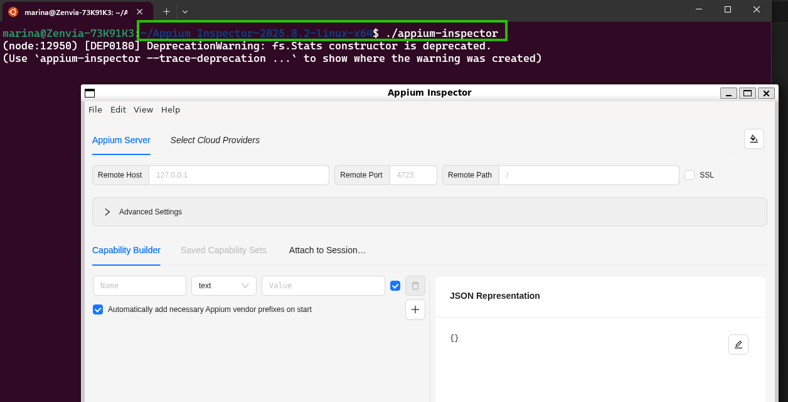
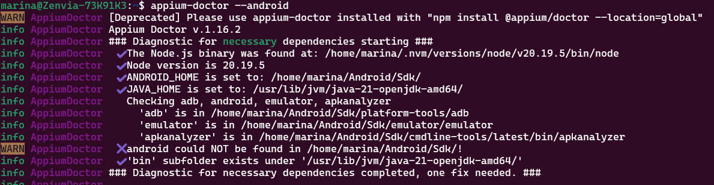
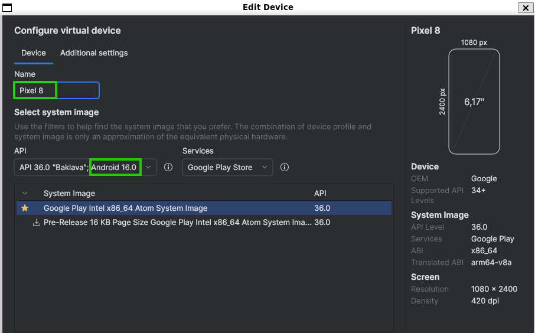
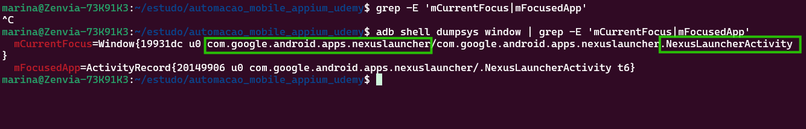
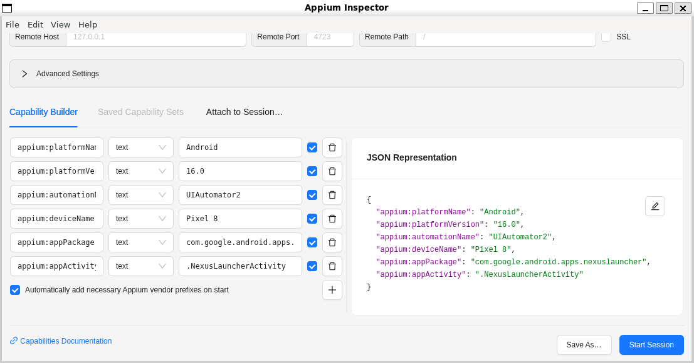
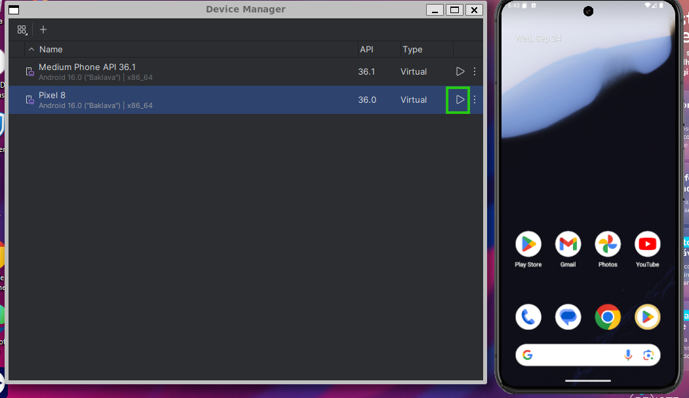
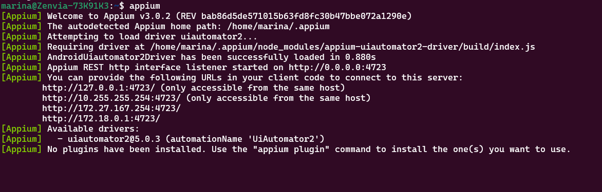
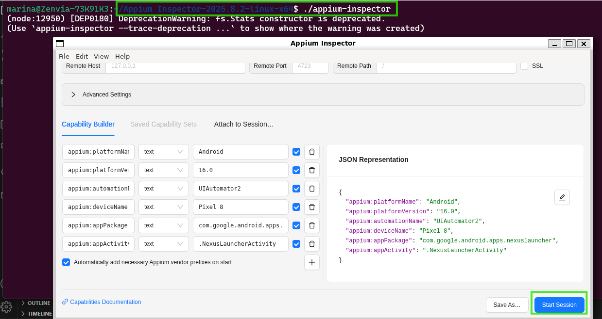

## Automatização mobile - Setup Appium - Tutorial

### Setup appium:

#### 1 - Install Appium 2.0

    npm i -g appium

Verificar se foi instalado corretamente:

    appium -v

#### 2 - Appium-inspector 

Interface gráfica do Appium. Permite visualizar e inspecionar a árvore de elementos de um aplicativo mobile.

- https://github.com/appium/appium-inspector/releases -> baixe
- Transfira a página para o diretório raiz (home/marina)
- Tire o zipe da pasta se ela estiver zipada
- Entre na pasta
- Execute : 

        ./appium-inspector
- Se não funcionar:
    -  instale as dependências e reveja as permissões:

            sudo apt-get install libnss3 libasound2 libnspr4 libgconf-2-4 libgtk-3-0

    - e reveja as permissões:

            chmod +x appium-inspector
- Ainda dentro da pasta, refaça o comando: 

        ./appium-inspector

    

#### 3 - Instalação do Appium UIAutomator2 

Driver/framework de automação que executa ações programadas (clicar, deslizar, etc.)  em um dispositivo Android.

    appium driver install uiautomator2

#### 4 - JAVA-HOME

Verifique se já possui o Java e se não tiver, instale. 

    java -- version

    sudo apt install openjdk-8-jdk

Execute o comando e copie a resposta,caminho de onde está o seu JDK (ex: /usr/lib/jvm/java-21-openjdk-amd64).

    update-alternatives --config java 

Abra o arquivo bashrc

    sudo vim ~/.bashrc

Teclado: insert -> ativar modo de inserção para alterar o arquivo

Navegue até o final do arquivo e cole a variável de ambiente "JAVA_HOME" junto com o caminho do seu jdk: 

    export $JAVA_HOME=/usr/lib/jvm/java-21-openjdk-amd64

Teclado: esc -> sair do modo de inserção

Salvar e sair do arquivo (w - escrever no arquivo; q salvar e sair do arquivo):

    :wq! 

Verificar se o arquivo foi alterado com sucesso:    

    cat ~/.bashrc

Recarregue o arquivo sem ter que reabrir o terminal 

    source ~/.bashrc  

#### 5 - Androide Studio (ADB Tools)
Ferramenta de desenvolvimento para criar o aplicativo.
#### 5.1 Instalação do Androide Studio

Execute:
 
    sudo apt install android-tools-adb
    adb version

Para abrir o Androide studio, produre ele entre suas ferramentas.

#### 5.2 Android Virtual Device - AVD 

Trata-se de uma configuração que define as características de um dispositivo Android (como um celular, tablet, TV ou carro) para que você possa simulá-lo em um emulador diretamente no seu computador.

 - More Actions > Virtual Device Manager > Create Virtual Device > name > sistema recomendado > finish > start 

    

    

    

    

5.2.1 Erro : /dev/kvm device: permission denied.

Solução: https://stackoverflow.com/questions/37300811/android-studio-dev-kvm-device-permission-denied  

Execute o comando para verificar quais usuários estão no kvmgrupo:

        grep kvm /etc/group

Adicione seu usuário ao grupo:

        sudo adduser $USER kvm

Verifique novamente se seu usuário aparace no root:

        grep kvm /etc/group

**Reiniciar pc**

5.2.3 Erro de virtualização aninhada: Ignorado 
https://stackoverflow.com/questions/70910844/android-emulator-problem-related-with-nested-virtualization 

#### 5.3 SDK (Software Development Kit)

Contém os componentes necessários para desenvolver, depurar e testar apps, como compiladores, depuradores, emuladores e acesso às APIs do sistema, e é gerenciado através do SDK Manager dentro do próprio Android Studio

Abra o arquivo bashrc

    sudo vim ~/.bashrc

Teclado: insert -> ativar modo de inserção para alterar o arquivo

Navegue até o final do arquivo e cole: 

    export PATH=$PATH:$ANDROID_HOME/platform-tools:$ANDROID_HOME/cmdline-tools/latest/bin

Teclado: esc -> sair do modo de inserção

Salvar e sair do arquivo (w - escrever no arquivo; q salvar e sair do arquivo):
    :wq! 

Verificar se o arquivo foi alterado com sucesso: 

    cat ~/.bashrc

Recarregue o arquivo sem ter que reabrir o terminal 

    source ~/.bashrc  

#### 6 - Instalação do Appium Doctor 

(ferramenta de linha de comando (CLI) que valida se todas as dependências e configurações necessárias para rodar o Appium estão instaladas e configuradas corretamente.)

    npm install -g appium-doctor

depois:

    appium-doctor --version

#### 6.1  Agora vamos verificar a lista de instações obrigatórias:

    appium-doctor --android

OBS: O Android é o único que pode permanecer com erro porque se refere a uma versão passada.

#### 7 - Capabilities (appium-inspector):

 Capabilities são um conjunto de parâmetros que você configura para informar ao Appium Server qual sessão de automação você deseja iniciar. Sem as Capabilities, o Appium Inspector não saberia em qual dispositivo (físico ou emulador), qual sistema operacional (Android ou iOS) e qual aplicativo ele deveria se conectar para inspecionar os elementos.

#### 7.1 Localizando parâmetros

- Abra o Appium Inspector e preencha os campos do Capabilities de acordo com as informações contindas no Android Studio:

    -  Nome, versão e device: 

        

- Execute seu emulador (AVD) e com ele funcionando, verifique a conexão para extrair mais dados. Como resposta deve ver seu dispositivo listado. 

        adb devices
 
- Com o aplicativo ainda em funcionamento, execute: 

        adb shell dumpsys window | grep -E 'mCurrentFocus|mFocusedApp'

    

    - appPackage -> o que está antes da barra

    - appActivity -> o que está depois da barra

#### 7.2 Preenchedo os campos 

{

  "appium:platformName": "Android",
  "appium:platformVersion": "16.0",
  "appium:automationName": "UIAutomator2",
  "appium:deviceName": "Pixel 8",
  "appium:appPackage": "com.google.android.apps.nexuslauncher",
  "appium:appActivity": ".NexusLauncherActivity"

}

### 8. Para iniciar o ambiente:

8.1 - Abrir o emulador por meio do Android studio.

8.2 - Subir o aapium executando o comando:

    appium

8.3 - Abrir o appium inspector e inserir o Capabilities. 
Na pasta do appium-inspector, executar o comando: 

    ./appium-inspector

