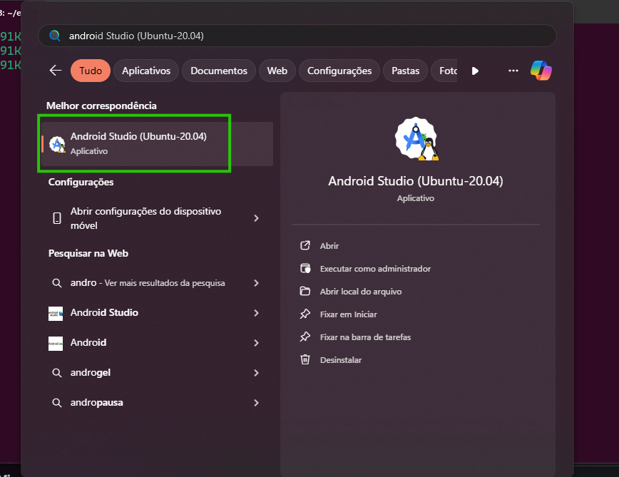
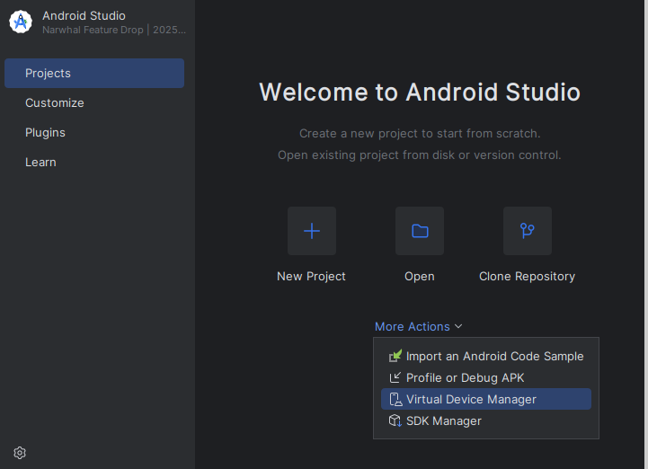
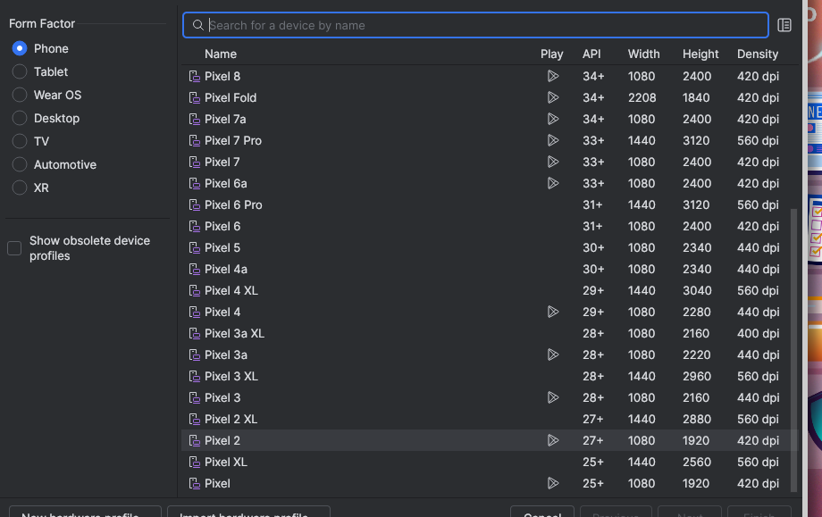
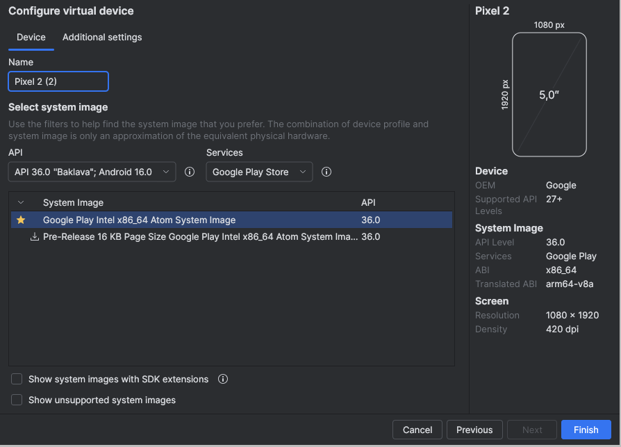
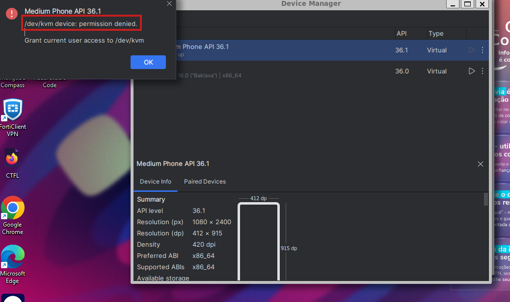
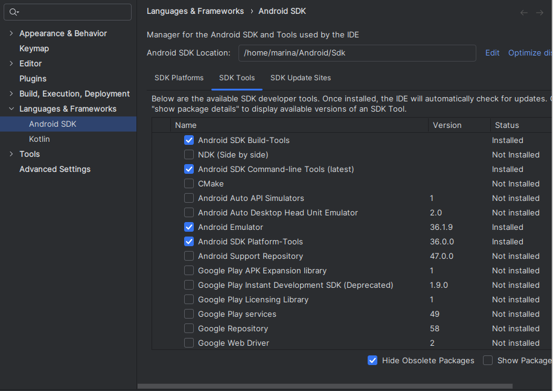

## Automatização mobile - Setup Appium - Tutorial

### Pré-requisitos para utilização do Appium:

### Setup appium:

1- Install Appium 2.0

    npm i -g appium

2- Verificar se foi instalado corretamente:

    appium -v

3- Install Appium UIAutomator2

    appium driver install uiautomator2

4- Install Appium Doctor

    npm install -g appium-doctor

depois:

    appium-doctor --version

5- Appium doctor para verificar se foi instalado corretamente:

    appium-doctor --android

    Agora vamos corrigir o que aparece com "x" na primeira listagem (obrigatórios)

6 - Appium-inspector (Interface do Appium)

    https://github.com/appium/appium-inspector/releases -> baixe
    - Transfira a página para o diretório raiz (home/marina)
    - Tire o zipe da pasta se ela estiver zipada
    - Entre na pasta
    - Execute : ./appium-inspector
    - Se não funcionar, instale dependências e reveja as permissões:

        sudo apt-get install libnss3 libasound2 libnspr4 libgconf-2-4 libgtk-3-0

        chmod +x appium-inspector
    - Refaça o comando: ./appium-inspector

7- JAVA-HOME

Verifique se já possui o Java e se não tiver, instale. 
    java -- version

    sudo apt install openjdk-8-jdk

Copie a resposta do comando, caminho de onde está o seu JDK (ex: /usr/lib/jvm/java-21-openjdk-amd64)

    update-alternatives --config java 

Abra o arquivo bashrc
    sudo vim ~/.bashrc

Teclado: insert -> ativar modo de inserção para alterar o arquivo

Navegue até o final do arquivo e cole: 

    export $JAVA_HOME=/usr/lib/jvm/java-21-openjdk-amd64

Teclado: esc -> sair do modo de inserção

Salvar e sair do arquivo (w - escrever no arquivo; q salvar e sair do arquivo):
    :wq! 

Verificar se o arquivo foi alterado com sucesso:    
    cat ~/.bashrc

Recarregue o arquivo sem ter que reabrir o terminal 
    source ~/.bashrc  

Agora, no appium-doctor a variável JAVA-HOME deve aparecer com check
    appium-doctor --android

8- Baixar o androide studio (ADB Tools)
 
    sudo apt install android-tools-adb
    adb version

Para abrir o Androide studio, produre ele entre suas ferramentas.

9 - Android Virtual Device (Dispositivo Virtual Android) - AVD (dentro do Android Studio)

More Actions > Virtual Device Manager > Create Virtual Device > name > sistema recomendado > finish > start 

Erro : /dev/kvm device: permission denied.

solução: https://stackoverflow.com/questions/37300811/android-studio-dev-kvm-device-permission-denied  

grep kvm /etc/group -> Para verificar quais usuários estão no kvmgrupo

sudo adduser $USER kvm -> Para adicionar seu usuário

grep kvm /etc/group -> para verificar novamente se seu usuário aparaceu no root. 

Reiniciar pc

Erro de virtualização aninhada 
https://stackoverflow.com/questions/70910844/android-emulator-problem-related-with-nested-virtualization 

10 - Software Development Kit - SDK (dentro do Android Studio)

Ele contém os componentes necessários para desenvolver, depurar e testar apps, como compiladores, depuradores, emuladores e acesso às APIs do sistema, e é gerenciado através do SDK Manager dentro do próprio Android Studio

Abra o arquivo bashrc
    sudo vim ~/.bashrc

Teclado: insert -> ativar modo de inserção para alterar o arquivo

Navegue até o final do arquivo e cole: 

    export PATH=$PATH:$ANDROID_HOME/platform-tools:$ANDROID_HOME/cmdline-tools/latest/bin

Teclado: esc -> sair do modo de inserção

Salvar e sair do arquivo (w - escrever no arquivo; q salvar e sair do arquivo):
    :wq! 

Verificar se o arquivo foi alterado com sucesso:    
    cat ~/.bashrc

Recarregue o arquivo sem ter que reabrir o terminal 
    source ~/.bashrc  

Agora, no appium-doctor o adb, emulator e o apkanalyzer deve aparecer com check
    appium-doctor --android

### Capabilities:

{
  "appium:platformName": "Android",
  "appium:platformVersion": "16.0",
  "appium:automationName": "UIAutomator2",
  "appium:deviceName": "Pixel 8",
  "appium:appPackage": "com.google.android.apps.nexuslauncher",
  "appium:appActivity": ".NexusLauncherActivity"
}

### Para iniciar o ambiente:

1- emulador(Por meio do Android studio)

2- appium (Por meio da linha de comando)

3- appium inspector

